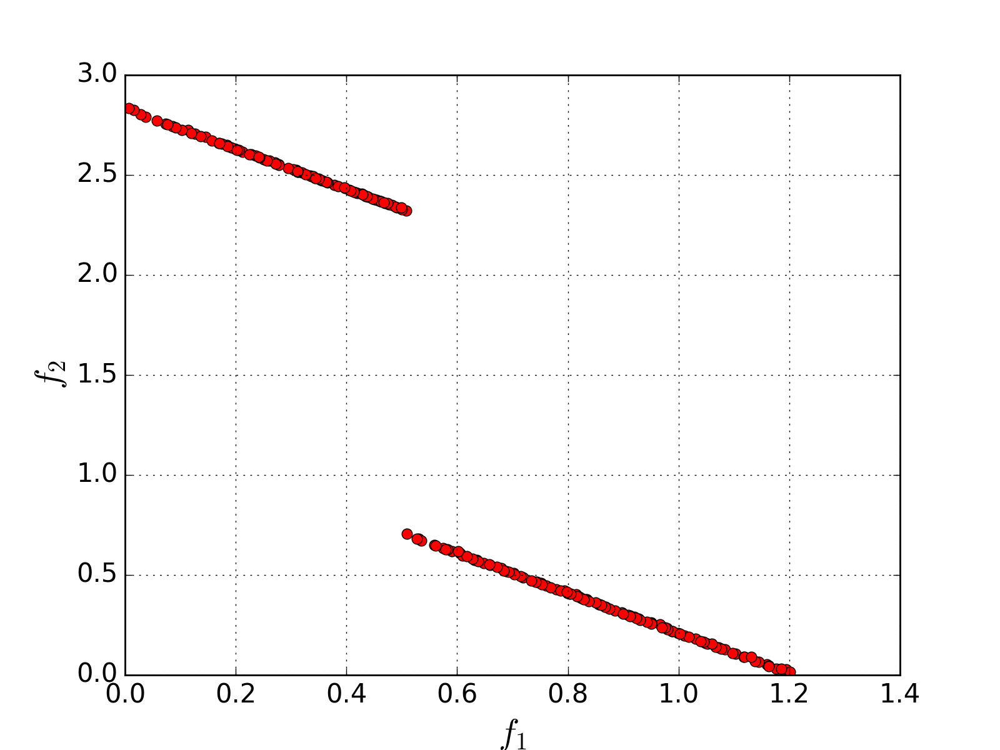

[](https://travis-ci.org/sovrasov/multicriterial-go)
[](https://coveralls.io/github/sovrasov/multicriterial-go?branch=master)
[](../master/LICENSE)
[](https://landscape.io/github/sovrasov/multicriterial-go/master)
# multicriterial-go
An implementation of the algorithm to solve multidimensional multicriterial global optimization problems with non-convex constraints. Exact problem statement can be found [here](https://en.wikipedia.org/wiki/Multi-objective_optimization). Description of the implemented method and numerical examples are presented in paper [Sovrasov V.: Parallel Multi-Objective Optimization Method for Finding Complete Set of Weakly Efficient Solutions, Proceedings of the 3rd Ural Workshop on Parallel, Distributed, and Cloud Computing for Young Scientists, Yekaterinburg, Russia, October 19th, 2017](http://ceur-ws.org/Vol-1990/paper-01.pdf).

The implementation is compact and designed to solve low-dimensional (1-4) problems with
Lipschitzian objectives and constraints (up to 5 constraints and objectives).
The method is theoretically proved to converge to all Slater points (in case of
Lipschitzian functions and sufficient reliability parameter `r`).

## How to clone & build
```bash
git clone --recursive https://github.com/sovrasov/multicriterial-go.git
cd multicriterial-go
mkdir build
cd build
cmake ..
make -j 4
```
## Minimal usage example
```c++
MCOProblem problem;
//define problem with two objectives
problem.AddCriterion(
  (const double* y) -> double {
    return fmin(hypot(y[0], y[1]) + .5, hypot(y[0] - 1.5, y[1] + 1.5));
  }
);
problem.AddCriterion(
  (const double* y) -> double {
    return hypot(y[0] + .5, y[1] - .5);
  }
);
//define search domain
problem.SetDomain(2, {-1., -2.}, {2., 1.});
//set algorithm parameters
auto parameters = SolverParameters(0.01, //accuracy
  0, //eps-reserves
  4, //reliability
  2, //number of threads
  2000, //iterations limit
  4); //local mix parameter

MCOSolver solver;
solver.SetParameters(parameters);
solver.SetProblem(problem);
solver.Solve();

auto solution = solver.GetWeakOptimalPoints();

//print points from Slater set and corresponding values of objectives
for(const auto& x : points)
{
  for(int i = 0; i < problem.GetDimension(); i++)
    cout << x.y[i] << ", ";
  for(int i = 0; i < problem.GetCriterionsNumber() - 1; i++)
    cout << x.z[i] << ", ";
  cout << x.z[problem.GetCriterionsNumber() - 1] << ";\n";
}
```

The resulting Slater points are shown on the picture below:



